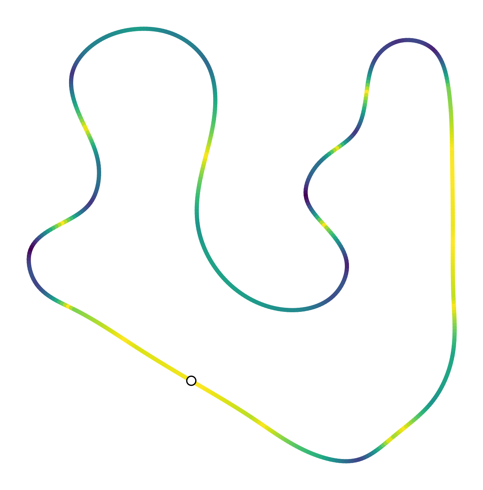

# Autonomous Kart

[](https://github.com/EVC-Purdue/AutonomousKart/actions/workflows/tests.yml)

Main codebase for the EVC 2025-26 Purdue Autonomous Kart team.




## Build

```exec into container
sudo docker exec -it ros2-dev bash
```

```bash
colcon build --packages-select autonomous_kart
source install/setup.bash
colcon test --packages-select autonomous_kart
```

## Run

```bash
ros2 launch autonomous_kart bringup_sim.launch.py   # simulation
ros2 launch autonomous_kart bringup_pi.launch.py    # on-kart
```

