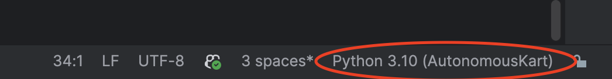

# EVC Dev Environment Setup (Pycharm)

This guide walks you through setting up the EVC 2025 development environment using **Pycharm Dev Containers**.

---

## Prerequisites

1. **Install Docker**
   - [Docker Desktop](https://docs.docker.com/desktop/setup/install/windows-install/) for Windows.
   - [Docker Desktop](https://docs.docker.com/desktop/setup/install/mac-install/) for MAC.
   - [Docker Engine](https://docs.docker.com/engine/install/) for Linux.
   - Verify:
     ```bash
     docker run --rm hello-world
     ```

2. **Install Pycharm**
   - [Download Pycharm](https://www.jetbrains.com/pycharm/download/?section=mac)

3. **Install Extensions**  
   - [Dev Containers](https://plugins.jetbrains.com/plugin/21962-dev-containers)
   - [Python](https://www.python.org/downloads/release/python-31018/)

4. **Authenticate with GHCR**  
    To get your token, click [here](https://github.com/settings/tokens) and generate a new token.
   ```bash
   docker login ghcr.io -u <your-username> --p <your-github-pat>
5. **Clone the repo into a new project**  
    ```bash
   git clone https://github.com/EVC-Purdue/AutonomousKart
6. **Open in Pycharm and go to `.devcontainer/devcontainer.json`**


7. **Select `Open in Dev Container`**  
   Pycharm should:
   - Create a new project
   - Pull the ghcr image
   - start the dev service
   - mount the repo at /ws
   - Run setup scripts
   - Install dependencies
8. **Set Python Interpreter**  
   - Go to the bottom right of your screen.
     - If it does not say `Python 3.10` go to `add new interpreter -> add local interpreter` and add `python3.10`
     

